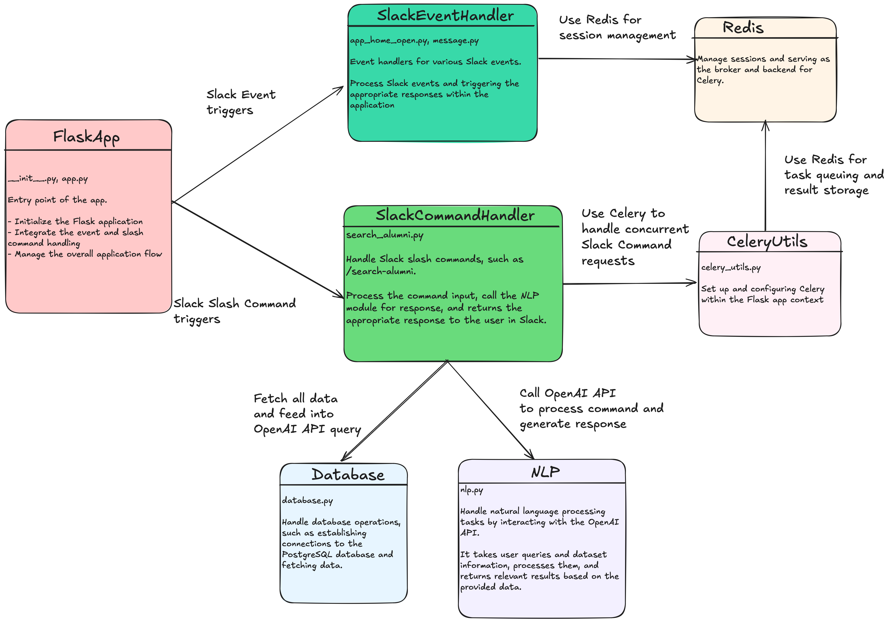

# 🎓 MCIT Alumni Search Slack Bot

## 📝 Overview

The MCIT Alumni Search Slack Bot is a powerful and handy tool that enables MCIT students to quickly and efficiently search for alumni information through Slack commands.

This bot integrates seamlessly with Slack using its API, employs OpenAI for advanced natural language processing, and relies on PostgreSQL for secure data storage. It also leverages Redis for session management to ensure smooth, consistent user experiences, and uses Celery for asynchronous task processing, allowing for efficient, concurrent handling of user queries.

## ✨ Key Features

- **Slack Integration**: Seamlessly interacts with users in Slack through commands and message events.
- **Natural Language Processing**: Uses OpenAI's API to process and understand user queries.
- **Database Management**: Stores and retrieves alumni data from a PostgreSQL database.
- **Asynchronous Task Processing**: Uses Celery and Redis to handle background tasks efficiently.
- **Session Management**: Utilizes Redis for session management to ensure a smooth user experience.

## 🗂️ Project Structure

- **`app.py`**: The main entry point for the Flask application.
- **`bot/`**: Contains the core bot logic, including command handlers, event processors, and utility functions.
- **`db/`**: Manages database connections and queries.
- **`config.py`**: Handles configuration, including environment variables.
- **`DEVELOPMENT.md`**: A detailed guide for setting up the development environment and workflow.
- **`README.md`**: Provides an overview of the project and general instructions.

## 🏗️ Architecture Overview

Below is a UML class diagram that provides an overview of the main components of the system and their interactions.

## ⚙️ Setup and Installation

For detailed setup and installation instructions, including how to configure your environment, install dependencies, and run the application, please refer to the [DEVELOPMENT.md](DEVELOPMENT.md).
